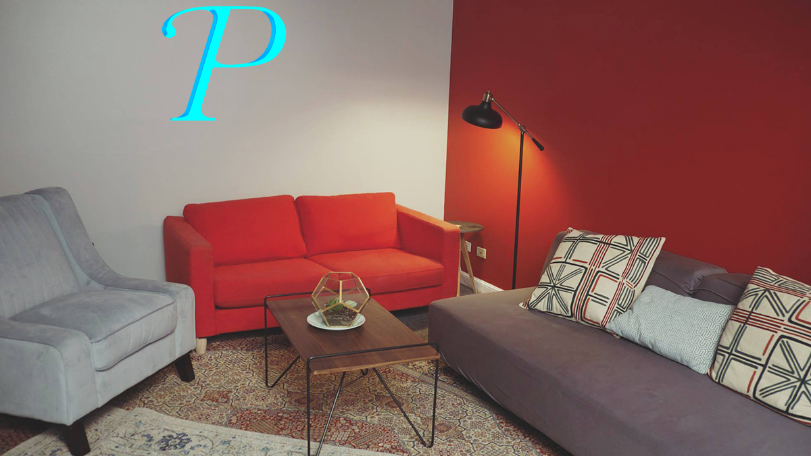

# color-mirror
This is a simple command line utility I started to learn some new things. Namely, I've been curious about extracting colors from a photo, then reflecting one or more of them back through an array of tiny LED lights, like shown in the following mockup.



## Dependencies
This program uses two small dependencies:
* [Commander](https://github.com/tj/commander.js)
* [node-vibrant](https://github.com/jariz/vibrant.js/)

## Installation
```
npm install
```

## Usage
Output the most vibrant color found in an image in RBG:
```
node color-mirror.js -i samples/test.jpg -r
```

Other output formats are available and can be chained.
For example, to get RGB, HSL, and Hex, you can use:
```
node color-mirror.js -i samples/test.jpg -rh#
```

You can adjust the quality (size scaling) of the image and
number of sample "buckets" used in determining the color:
```
node color-mirror.js -i samples/test.jpg -rh#
```
I recommend reading [Cate Huston's blog post](http://www.catehuston.com/blog/2013/08/26/extracting-the-dominant-color-from-an-image-in-processing/) where she goes into explaining how the size of the image and the number of color buckets affect calculating color values from an image.

To get a full list of command line arguments available, use:
```
node color-mirror.js --help
```


## References
* [Extracting the Dominant Color From an Image in Processing](http://www.catehuston.com/blog/2013/08/26/extracting-the-dominant-color-from-an-image-in-processing/)
* [Creating Your First Node.js Command-line Application](http://tutorialzine.com/2014/09/creating-your-first-node-js-command-line-application/)

## Goals
1. Feed a photo into the program and extract some colors from it. The most dominant color in a photo is often something boring found in the backgroud, so we'll use the most vibrant color instead.

2. Get the program running on a low-power computer, like a Raspberry Pi. Then we'll make the program change the color of a few tiny LED lights that we'll hook up to the computer.

3. Hook up a camera to the computer, and program it to take a picture whenever someone walks in front of it. We need to be respectful of privacy here. Since all we need is a vibrant color from the photo, we can probably keep the camera out of focus, and we'll obviously want to delete the photo once we're done with it.

4. Mount the camera, computer, and LED lights inside of a fun object that can be hung on a wall!
